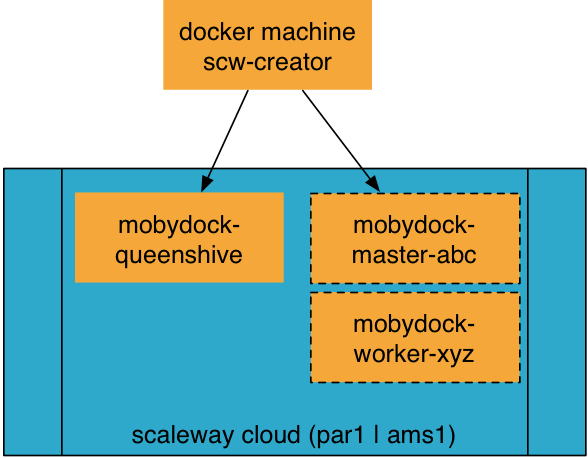
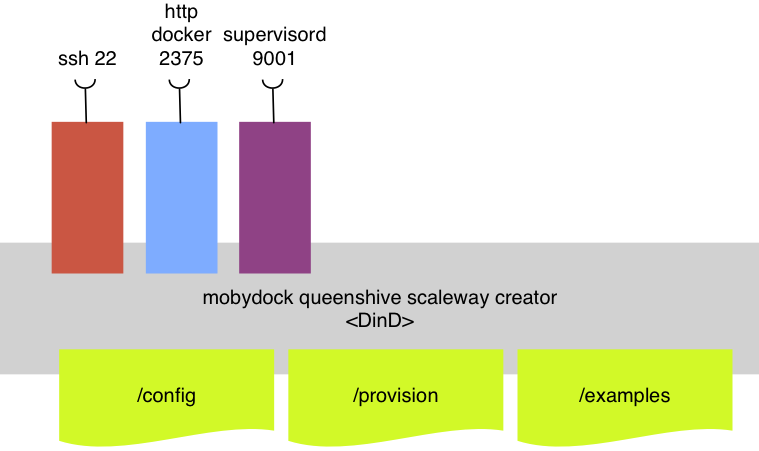

# Docker Creator of scaleway machines as a jump host

Build a container to create [scaleway](https://www.scaleway.com/) docker machines.



* Based on [DinD](https://hub.docker.com/_/docker/)
* Access with ssh
* scaleway cli and scaleway docker machine driver

## Build the docker machine scw creator

```
$ docker build -t bee42/scw-docker-machine-creator .
```

### build args

| ARG                      | Default   |
|:-------------------------|:----------|
| COMPOSE_VERSION          | `1.8.1`   |
| MACHINE_VERSION          | `0.8.2`   |
| GLIBC_VERSION            | '2.23-r3' |
| SCALEWAY_VERSION         | `1.11`    |
| SCALEWAY_MACHINE_VERSION | `1.3`     |

```
$ docker build --build-args COMPOSE_VERSION=1.9.0-rc3 -t xxx/scw-docker-machine-creator:with_compose_1.9 https://github.com/bee42/scw-docker-machine-creator .
```

## Usage of the creator
```
$ docker run -d -p 2222:22 \
  -v `pwd`/config:/config \
  --privileged \
  bee42/scw-docker-machine-creator
$ ssh -p 2222 creator@<docker scw-docker-machine-creator ip>
# pw: creator
```



More services are available

| port | service                 |
|:-----|:------------------------|
| 22   | sshd                    |
| 2375 | uncrypted docker engine |
| 9001 | supervisord admin       |

## Usage with docker compose

```
$ export SCALEWAY_TOKEN=xxx
$ export SCALEWAY_ORGANIZATION=xxx
$ export SCALEWAY_REGION=ams1
$ docker-compose up -d
$ docker-compose exec --user creator scw-creator /bin/bash
```

access ssh port

```
$ ssh \
 -p $(docker-compose port scw-creator 22 |awk 'BEGIN { FS=":" } /1/ { print $2 }') \
 creator@127.0.0.1
```

## Usage of scaleway docker machine creator

```
# login with ssh
cat >scw_access <<EOF
export SCALEWAY_TOKEN=XXX_YYY_ZZZ
export SCALEWAY_ORGANIZATION=XXX_YYY_ZZZ
export SCALEWAY_REGION=ams1
EOF
$ source scw_access
# par1 | ams1
$ curl -H "X-Auth-Token: ${SCALEWAY_TOKEN}" \
 -H 'Content-Type: application/json' \
"https://cp-${SCALEWAY_REGION}.scaleway.com/servers"
$ curl -H "X-Auth-Token: ${SCALEWAY_TOKEN}" \
  -H 'Content-Type: application/json' \
"https://cp-${SCALEWAY_REGION}.scaleway.com/images" | jq ".images[]"
$ curl -H "X-Auth-Token: ${SCALEWAY_TOKEN}" \
  -H 'Content-Type: application/json' \
"https://cp-${SCALEWAY_REGION}.scaleway.com/images" \
  | jq '.images[] | { "name": .name , "id": .id, "arch": .arch }'
# create your first docker machine
$ docker-machine create -d scaleway \
  --scaleway-name="cloud-scaleway-2" \
  cloud-scaleway
```

## Hints: Scaleway tools

* https://github.com/scaleway/scaleway-cli
* https://github.com/scaleway/docker-machine-driver-scaleway

## Make your certs transferable

```
$ dctrl master-node
$ CONTROL=master-node
$ eval \$(docker run --rm --volumes-from $CONTROL alpine
       sed 's/DOCKER_/DOCKERCONTROL_/' /docker/env)"
# start a container to access this engine
$ docker run --volumes-from $CONTROL \
  -e DOCKER_HOST=\$DOCKERCONTROL_HOST \
  -e DOCKER_TLS_VERIFY=\$DOCKERCONTROL_TLS_VERIFY \
  -e DOCKER_CERT_PATH=\$DOCKERCONTROL_CERT_PATH \
  -e DOCKER_API_VERSION=\$DOCKERCONTROL_API_VERSION \
  …
```

* https://github.com/jpetazzo/dctrl

## TODO

* More examples to provision a docker swarming cluster

## Links

* https://github.com/scaleway/scaleway-cli
* https://github.com/andyshinn/alpine-pkg-glibc
* https://github.com/jeanblanchard/docker-alpine-glibc/blob/master/Dockerfile
* https://stedolan.github.io/jq/manual/#Basicfilters
* http://label-schema.org/rc1/
* http://blog.hypriot.com/post/test-build-and-package-docker-for-arm-the-official-way/
* http://blog.hypriot.com/post/setting-up-100-nodes-jenkins-cluster-with-docker-swarm-in-less-than-10-minutes/
* https://github.com/scaleway-community/scaleway-docker
* https://nathanleclaire.com/blog/2016/08/11/curl-with-http2-support---a-minimal-alpine-based-docker-image/
***

Regards
Peter

<peter.rossbach@bee42.com> @PRossbach
